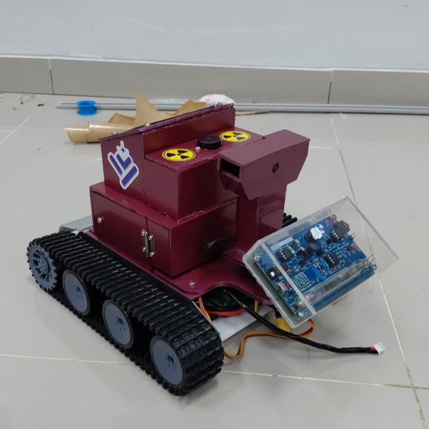

# 🛡️ Sistem Mobile Monitoring Radiasi Berbasis IoT

[](https://opensource.org/licenses/MIT)
[](https://www.espressif.com/en/products/socs/esp32)
[]()

> **Pengembangan Sistem Mobile Monitoring Radiasi Berbasis IoT Untuk Sarana Edukasi Pengukuran Radiasi Lingkungan**

**🌐 Web Dashboard:** [https://carlins-three.web.app/](https://carlins-three.web.app/)

Sistem monitoring radiasi real-time berbasis IoT yang menggunakan robot beroda untuk deteksi radiasi lingkungan secara mobile. Dirancang untuk keperluan edukasi dan monitoring area dengan dashboard web interaktif dan notifikasi Telegram.

---

## 📋 Daftar Isi

- [Gambaran Umum](#-gambaran-umum)
- [Fitur Utama](#-fitur-utama)
- [Arsitektur Sistem](#-arsitektur-sistem)
- [Komponen Hardware](#-komponen-hardware)
- [Spesifikasi Teknis](#-spesifikasi-teknis)
- [Instalasi](#-instalasi)
- [Konfigurasi](#-konfigurasi)
- [Penggunaan](#-penggunaan)
- [Kalibrasi](#-kalibrasi)
- [API & Endpoint](#-api--endpoint)
- [Troubleshooting](#-troubleshooting)
- [Kontribusi](#-kontribusi)
- [Lisensi](#-lisensi)
- [Tim Pengembang](#-tim-pengembang)

---

## 🎯 Gambaran Umum

Sistem ini merupakan implementasi teknologi IoT untuk monitoring radiasi lingkungan menggunakan platform mobile robot. Dirancang khusus untuk keperluan edukasi, penelitian, dan monitoring area yang berpotensi memiliki radiasi tinggi tanpa perlu menempatkan manusia di lokasi berbahaya.

### Keunggulan
- ✅ **Mobile & Remote Controlled**: Robot dapat dikendalikan dari jarak jauh via web interface
- ✅ **Real-time Monitoring**: Data radiasi ditampilkan secara real-time di dashboard web
- ✅ **Smart Alert System**: Notifikasi otomatis ke Telegram saat terdeteksi radiasi berbahaya
- ✅ **Visual Monitoring**: Kamera ESP32-CAM untuk pemantauan visual area
- ✅ **Scanning Mode**: Servo motor untuk scanning area 180° secara otomatis
- ✅ **Calibrated Sensor**: Menggunakan kalibrasi regresi linear untuk akurasi tinggi

---

## ✨ Fitur Utama

### 1. **Geiger Counter Monitoring**
- Deteksi radiasi menggunakan sensor Geiger-Müller
- Pengukuran CPS (Counts Per Second) dan CPM (Counts Per Minute)
- Konversi ke µSv/jam dengan faktor kalibrasi
- Kalibrasi berbasis regresi linear: `Dosis = 0.3859 × Dosis_Kit + 0.2319`

### 2. **Dashboard Web Responsif**
- Interface modern dengan real-time update (1 detik)
- Visualisasi data: CPS, CPM, dan µSv/jam
- Indikator status warna:
  - 🟢 **HIJAU** - Aman (CPS < 2)
  - 🟠 **ORANYE** - Waspada (2 ≤ CPS < 5)
  - 🔴 **MERAH** - Bahaya (CPS ≥ 5)
- Progress bar dinamis untuk intensitas radiasi

### 3. **Kontrol Robot Mobile**
- Kontrol pergerakan 4 arah (Maju, Mundur, Kiri, Kanan)
- Interface web dengan kontrol touch-friendly
- Mode STOP darurat
- Mode SCAN otomatis dengan servo (180° sweep)

### 4. **ESP32-CAM Live Stream**
- Video streaming resolusi VGA
- Akses via web browser
- Monitoring visual area secara real-time

### 5. **Notifikasi Telegram**
- Notifikasi otomatis saat bahaya terdeteksi
- Cooldown 60 detik untuk menghindari spam
- Informasi lengkap: Status, CPS, Dosis, dan Link dashboard

### 6. **LCD Display Lokal**
- Display 20×4 karakter (I2C)
- Informasi real-time: Status, CPS, µSv/jam, IP Address
- Indikator buzzer untuk peringatan bahaya

---

## 🏗️ Arsitektur Sistem

```
┌─────────────────────────────────────────────────────────────┐
│                     MOBILE RADIATION ROBOT                  │
├─────────────────────────────────────────────────────────────┤
│                                                               │
│  ┌───────────────┐  ┌───────────────┐  ┌───────────────┐   │
│  │  ESP32 #1     │  │  ESP32 #2     │  │  ESP32-CAM    │   │
│  │  (Geiger)     │  │  (Controller) │  │  (Visual)     │   │
│  └───────┬───────┘  └───────┬───────┘  └───────┬───────┘   │
│          │                  │                  │            │
│  ┌───────▼──────┐  ┌────────▼────────┐ ┌───────▼───────┐   │
│  │Geiger Counter│  │  L298N Driver   │ │  OV2640 Cam   │   │
│  │LCD 20x4 I2C  │  │  Servo Motor    │ │               │   │
│  │Buzzer Alert  │  │  Chassis Track  │ │               │   │
│  └──────────────┘  └─────────────────┘ └───────────────┘   │
│                                                               │
└─────────────┬───────────────────────────────────────────────┘
              │
         WiFi Network
              │
┌─────────────▼───────────────────────────────────────────────┐
│                    USER INTERFACE LAYER                      │
├─────────────────────────────────────────────────────────────┤
│                                                               │
│  ┌───────────────┐  ┌───────────────┐  ┌───────────────┐   │
│  │  Web Dashboard│  │  Robot Control│  │  Camera Stream│   │
│  │  (Port 80)    │  │  (Port 80)    │  │  (Port 80)    │   │
│  └───────────────┘  └───────────────┘  └───────────────┘   │
│                                                               │
│  ┌───────────────────────────────────────────────────────┐   │
│  │              Telegram Bot Notification                │   │
│  │            (Alert & Status Messages)                  │   │
│  └───────────────────────────────────────────────────────┘   │
│                                                               │
└─────────────────────────────────────────────────────────────┘
```

### Data Flow

```
Radiasi → Geiger Tube → Pulse Count → ESP32 Interrupt
                                           ↓
                                    Kalkulasi CPS/CPM
                                           ↓
                                    Kalibrasi Linear
                                           ↓
                            ┌──────────────┴──────────────┐
                            ↓                             ↓
                      Web Dashboard              Telegram Alert
                    (JSON API /data)            (Saat Bahaya)
                            ↓
                       LCD Display
```

---

## 🔧 Komponen Hardware

### ESP32 Module #1 - Geiger Detector
| Komponen | Spesifikasi | Fungsi |
|----------|-------------|--------|
| ESP32 DevKit | 240MHz, WiFi+BT | Microcontroller utama |
| Geiger-Müller Tube | Deteksi β, γ | Sensor radiasi |
| LCD I2C 20×4 | Alamat 0x27 | Display lokal |
| Buzzer Aktif | 5V | Alarm bahaya |

**Pinout:**
- GPIO 4: Geiger Pulse Input
- GPIO 14: Buzzer Output
- GPIO 21: I2C SDA (LCD)
- GPIO 22: I2C SCL (LCD)

### ESP32 Module #2 - Robot Controller
| Komponen | Spesifikasi | Fungsi |
|----------|-------------|--------|
| ESP32 DevKit | 240MHz, WiFi+BT | Kontrol pergerakan |
| L298N Motor Driver | Dual H-Bridge, 2A | Penggerak motor DC |
| Servo SG90 | 180°, 1.5kg/cm | Scanning kamera |
| Motor DC Gearbox | 6V, 200 RPM | Penggerak roda |
| Tank Chassis | Track beroda | Basis robot mobile |

**Pinout:**
- GPIO 4-7: L298N Control (IN1-IN4)
- GPIO 13: Servo Signal

### ESP32-CAM Module
| Komponen | Spesifikasi | Fungsi |
|----------|-------------|--------|
| ESP32-CAM AI Thinker | OV2640 Camera | Video streaming |
| Camera OV2640 | 2MP, JPEG | Monitoring visual |

**Konfigurasi Kamera:**
- Frame Size: VGA (640×480)
- JPEG Quality: 10
- Frame Buffer: 2 (dengan PSRAM)

### Power System
- **Geiger Module**: Power Bank 5V 2A
- **Robot Controller**: Battery Li-Po 7.4V 2200mAh
- **ESP32-CAM**: Buck Converter 5V dari battery utama

---

## 📊 Spesifikasi Teknis

### Sensor Geiger Counter
- **Tipe**: Geiger-Müller Tube (β, γ radiation)
- **Range Deteksi**: 0.01 - 100 µSv/jam
- **Akurasi**: ±15% (setelah kalibrasi)
- **Response Time**: < 1 detik
- **Faktor Konversi Raw**: 151 CPM/µSv
- **Kalibrasi**: Linear Regression Model
  - Koefisien K: 0.3859
  - Intercept: 0.2319 µSv/jam
  - Formula: `Dosis_Kalibrasi = 0.3859 × (CPM/151) + 0.2319`

### Threshold Keamanan
| Level | CPS Range | µSv/jam (approx) | Status | Aksi |
|-------|-----------|------------------|--------|------|
| Aman | 0 - 1.99 | < 0.8 | 🟢 AMAN | Normal monitoring |
| Waspada | 2 - 4.99 | 0.8 - 2.0 | 🟠 WASPADA | Heightened alert |
| Bahaya | ≥ 5 | > 2.0 | 🔴 BAHAYA | Buzzer + Telegram |

### Performa Robot
- **Kecepatan Maksimal**: ~0.3 m/s
- **Runtime**: 2-3 jam (Battery 2200mAh)
- **Berat Total**: ~1.5 kg
- **Dimensi**: 25cm × 18cm × 15cm
- **Servo Scan Time**: ~10 detik (180° sweep)

### Network & Connectivity
- **WiFi**: 802.11 b/g/n (2.4 GHz)
- **Web Server Port**: 80 (HTTP)
- **Update Rate**: 1 detik (dashboard), 1000ms (internal loop)
- **Telegram API**: HTTPS dengan SSL/TLS

---

## 🚀 Instalasi

### Prerequisites
1. **Arduino IDE** (v1.8.19 atau lebih baru)
2. **ESP32 Board Support**
   ```
   File → Preferences → Additional Board Manager URLs:
   https://dl.espressif.com/dl/package_esp32_index.json
   ```
3. **Library Dependencies**:
   ```
   - WiFi (Built-in ESP32)
   - WebServer (Built-in ESP32)
   - Wire (Built-in)
   - LiquidCrystal_I2C (v1.1.2)
   - WiFiClientSecure (Built-in ESP32)
   - UniversalTelegramBot (v1.3.0)
   - ESP32Servo (v0.13.0)
   - esp_camera (Built-in ESP32)
   ```

### Instalasi Library via Arduino IDE
```bash
Sketch → Include Library → Manage Libraries
```
Cari dan install:
- `LiquidCrystal_I2C` by Frank de Brabander
- `UniversalTelegramBot` by Brian Lough
- `ESP32Servo` by Kevin Harrington

### Upload Program

#### 1. Geiger Detector Module
```bash
1. Buka file: geiger-detector/geiger-detector.ino
2. Pilih Board: ESP32 Dev Module
3. Set Port: (sesuai device Anda)
4. Upload
```

#### 2. Robot Controller Module
```bash
1. Buka file: controller/controller.ino
2. Pilih Board: ESP32 Dev Module
3. Upload
```

#### 3. ESP32-CAM Module
```bash
1. Buka file: espcam/espcam.ino
2. Pilih Board: AI Thinker ESP32-CAM
3. Sambungkan GPIO 0 ke GND (programming mode)
4. Upload
5. Lepas jumper GPIO 0, tekan RESET
```

---

## ⚙️ Konfigurasi

### 1. Konfigurasi WiFi
Edit di setiap file `.ino`:

```cpp
const char* ssid = "NAMA_WIFI_ANDA";
const char* password = "PASSWORD_WIFI_ANDA";
```

### 2. Konfigurasi Telegram Bot
Di file `geiger-detector.ino`:

```cpp
const char* botToken = "YOUR_BOT_TOKEN_FROM_BOTFATHER";
const char* chatID = "YOUR_CHAT_ID";
```

**Cara mendapatkan Bot Token:**
1. Chat dengan [@BotFather](https://t.me/botfather) di Telegram
2. Kirim `/newbot` dan ikuti instruksi
3. Copy token yang diberikan

**Cara mendapatkan Chat ID:**
1. Chat dengan [@userinfobot](https://t.me/userinfobot)
2. Copy ID yang ditampilkan

### 3. Konfigurasi Threshold (Opsional)
Di file `geiger-detector.ino` (baris 52-53):

```cpp
const int THRESHOLD_WASPADA = 2;  // CPS untuk status WASPADA
const int THRESHOLD_BAHAYA  = 5;  // CPS untuk status BAHAYA
```

### 4. Konfigurasi Kalibrasi (Advanced)
Jika Anda memiliki sumber referensi standar, edit kalibrasi di baris 23-26:

```cpp
const float CALIBRATION_FACTOR_K = 0.3859;    // Slope
const float CALIBRATION_INTERCEPT = 0.2319;   // Y-intercept
const float INITIAL_CONV_FACTOR = 151.0;      // CPM to µSv/h
```

---

## 💻 Penggunaan

### 1. Power On Sistem
1. Nyalakan power bank untuk Geiger Module
2. Nyalakan battery untuk Robot Controller & ESP32-CAM
3. Tunggu koneksi WiFi (indikasi di LCD)

### 2. Akses Dashboard Monitoring

**Web Dashboard Online:**  
[https://carlins-three.web.app/](https://carlins-three.web.app/)

**Dashboard Lokal (jika terkoneksi ke device):**
```
http://[IP_ESP32_GEIGER]/
```
*IP Address akan ditampilkan di LCD atau Serial Monitor*

**Dashboard Features:**
- Real-time radiation level (CPS, CPM, µSv/h)
- Color-coded status indicator
- Progress bar visualization
- Auto-refresh setiap detik

### 3. Kontrol Robot
```
http://[IP_ESP32_CONTROLLER]/
```

**Kontrol yang tersedia:**
- **MAJU** - Gerakkan robot maju
- **MUNDUR** - Gerakkan robot mundur
- **KIRI** - Belok kiri
- **KANAN** - Belok kanan
- **STOP** - Hentikan semua gerakan
- **SCAN** - Servo scan 180° (10 detik)

**Tips:**
- Gunakan kontrol sentuh/klik untuk gerakan responsif
- Tombol bekerja dengan `onmousedown`/`onmouseup` untuk kontrol hold-to-move
- Mode SCAN berguna untuk survey area luas

### 4. Monitoring Kamera
```
http://[IP_ESP32_CAM]/
```

**Camera Features:**
- Live streaming video
- Resolusi VGA (640×480)
- Frame rate: ~15-20 fps
- Low latency untuk monitoring real-time

### 5. Telegram Notification
- Bot akan otomatis mengirim pesan saat status BAHAYA
- Notifikasi berisi:
  - Status bahaya
  - Nilai CPS saat ini
  - Dosis radiasi (µSv/jam)
  - Link langsung ke dashboard
- Cooldown: 60 detik antar notifikasi

---

## 🔬 Kalibrasi

Sistem menggunakan **kalibrasi regresi linear** untuk meningkatkan akurasi pengukuran.

### Model Kalibrasi
```
Dosis_Standar = K × Dosis_Kit + Intercept
```

**Parameter saat ini:**
- **K** (Slope): 0.3859
- **Intercept**: 0.2319 µSv/jam
- **R²**: ~0.95 (korelasi tinggi)

### Cara Kalibrasi Ulang (untuk peneliti)

#### Peralatan yang dibutuhkan:
- Sumber radiasi standar terverifikasi
- Dosimeter referensi (kalibrasi valid)
- Minimal 5 titik pengukuran berbeda

#### Langkah:
1. **Kumpulkan Data Pasangan**
   ```
   Ukur menggunakan:
   - Sistem Anda (Dosis_Kit) 
   - Referensi Standar (Dosis_Std)
   
   Di 5+ tingkat radiasi berbeda
   ```

2. **Analisis Regresi Linear**
   ```python
   import numpy as np
   from sklearn.linear_model import LinearRegression
   
   X = np.array([dosis_kit_values]).reshape(-1, 1)
   y = np.array([dosis_std_values])
   
   model = LinearRegression()
   model.fit(X, y)
   
   K = model.coef_[0]
   Intercept = model.intercept_
   ```

3. **Update Firmware**
   ```cpp
   const float CALIBRATION_FACTOR_K = [K_hasil_regresi];
   const float CALIBRATION_INTERCEPT = [Intercept_hasil_regresi];
   ```

4. **Verifikasi**
   - Ukur ulang dengan sumber standar
   - Bandingkan hasil dengan referensi
   - Error seharusnya < 15%

### Background Radiation
Sistem sudah mengkompensasi background radiation (0.2319 µSv/jam) berdasarkan pengukuran lingkungan normal.

---

## 📡 API & Endpoint

### Geiger Detector Module

#### `GET /`
Menampilkan dashboard HTML utama.

**Response:** HTML page

#### `GET /data`
Mendapatkan data radiasi dalam format JSON.

**Response:**
```json
{
  "cps": 1,
  "cpm": 60,
  "usv": 0.6297,
  "status": "AMAN",
  "color": "#2ecc71"
}
```

**Fields:**
- `cps`: Counts Per Second (integer)
- `cpm`: Counts Per Minute (integer)
- `usv`: Dosis radiasi µSv/jam (float, 4 desimal)
- `status`: "AMAN" | "WASPADA" | "BAHAYA!"
- `color`: Hex color untuk UI (#2ecc71 / #f39c12 / #e74c3c)

**Update Frequency:** Real-time, refresh via AJAX setiap 1 detik

---

### Robot Controller Module

#### `GET /`
Menampilkan panel kontrol robot.

**Response:** HTML page dengan control buttons

#### `POST /maju`
Gerakkan robot maju.

**Response:** 
```
Status: 200 OK
Body: "MAJU"
```

#### `POST /mundur`
Gerakkan robot mundur.

**Response:** 
```
Status: 200 OK
Body: "MUNDUR"
```

#### `POST /kiri`
Belokkan robot ke kiri.

**Response:** 
```
Status: 200 OK
Body: "KIRI"
```

#### `POST /kanan`
Belokkan robot ke kanan.

**Response:** 
```
Status: 200 OK
Body: "KANAN"
```

#### `POST /stop`
Hentikan semua gerakan motor.

**Response:** 
```
Status: 200 OK
Body: "STOP"
```

#### `POST /scan`
Jalankan servo scanning 180°.

**Response:** 
```
Status: 200 OK
Body: "SCAN"
```
**Duration:** ~10 detik

---

### ESP32-CAM Module

#### `GET /`
Stream video dari kamera.

**Response:** MJPEG Stream (Motion JPEG)

**Camera Settings:**
- Format: JPEG
- Resolution: VGA (640×480) dengan PSRAM, QVGA tanpa PSRAM
- Quality: 10 (0-63, lower is better)
- Frame Buffer: 2

---

## 🐛 Troubleshooting

### Masalah Umum

#### 1. **ESP32 tidak connect ke WiFi**
**Gejala:** LCD menampilkan "Connecting WiFi..." terus menerus

**Solusi:**
- Periksa SSID dan password (case-sensitive)
- Pastikan WiFi 2.4 GHz (ESP32 tidak support 5 GHz)
- Check jarak dari router (maks ~10 meter dengan obstacles)
- Restart ESP32 dan router

#### 2. **Geiger counter tidak mendeteksi pulsa**
**Gejala:** CPS dan CPM selalu 0

**Solusi:**
- Periksa koneksi kabel Geiger tube ke GPIO 4
- Pastikan Geiger tube mendapat tegangan tinggi (400-500V dari module)
- Test dengan sumber radiasi lemah (keramik lama, garam KCl)
- Periksa interrupt dengan Serial debugging

```cpp
void IRAM_ATTR onPulse() {
  pulseCount++;
  Serial.println("Pulse detected!"); // Tambahkan ini untuk debug
}
```

#### 3. **LCD tidak menampilkan teks**
**Gejala:** LCD backlight nyala tapi tidak ada teks

**Solusi:**
- Periksa alamat I2C: scan dengan kode I2C scanner
- Coba ubah alamat:
  ```cpp
  LiquidCrystal_I2C lcd(0x3F, 20, 4); // Coba 0x3F jika 0x27 gagal
  ```
- Periksa koneksi SDA (GPIO 21) dan SCL (GPIO 22)
- Kontras LCD: putar potensiometer di belakang module I2C

#### 4. **Telegram bot tidak mengirim notifikasi**
**Gejala:** Tidak ada pesan saat status BAHAYA

**Solusi:**
- Verifikasi Bot Token dan Chat ID
- Test koneksi dengan kode sederhana:
  ```cpp
  bot.sendMessage(chatID, "Test message", "");
  ```
- Pastikan `client.setInsecure()` dipanggil sebelum bot.sendMessage
- Check waktu sistem ESP32 (cert validation)

#### 5. **Motor robot tidak bergerak**
**Gejala:** Web control berfungsi tapi robot tidak bergerak

**Solusi:**
- Periksa power battery (min 6V)
- Test motor langsung dengan jumper ke L298N
- Verifikasi koneksi:
  - IN1-IN4 ke ESP32 GPIO 4-7
  - OUT1-OUT4 ke motor
  - Enable jumper terpasang di L298N
- Check wiring L298N:
  ```
  IN1-IN2: Motor Kanan
  IN3-IN4: Motor Kiri
  ```

#### 6. **ESP32-CAM tidak streaming**
**Gejala:** Halaman tidak load / error saat akses

**Solusi:**
- Pastikan GPIO 0 TIDAK tersambung GND saat running (hanya saat upload)
- Tekan tombol RESET setelah upload
- Periksa PSRAM:
  ```cpp
  if(psramFound()){
    Serial.println("PSRAM detected");
  } else {
    Serial.println("No PSRAM - using lower resolution");
  }
  ```
- Kurangi resolusi jika lag:
  ```cpp
  config.frame_size = FRAMESIZE_QVGA; // Lebih kecil, lebih smooth
  ```

#### 7. **Dashboard tidak update real-time**
**Gejala:** Data stuck / tidak berubah

**Solusi:**
- Buka Browser Console (F12) cek error JavaScript
- Pastikan endpoint `/data` bisa diakses:
  ```
  http://[IP_ESP32]/data
  ```
- Periksa CORS jika akses cross-domain
- Disable browser cache / hard refresh (Ctrl+F5)

#### 8. **Nilai radiasi tidak akurat**
**Gejala:** Hasil berbeda jauh dari dosimeter referensi

**Solusi:**
- Lakukan kalibrasi ulang (lihat bagian Kalibrasi)
- Pastikan Geiger tube sudah "warm up" (5-10 menit)
- Tunggu minimal 60 detik untuk nilai stabil
- Check background radiation: 0.1-0.3 µSv/jam normal
- Verifikasi faktor konversi sesuai datasheet Geiger tube Anda

---

### Debug Mode

Enable serial debugging untuk troubleshooting:

```cpp
void setup() {
  Serial.begin(115200);
  Serial.setDebugOutput(true); // Enable ESP32 debug
}

void loop() {
  Serial.print("CPS: "); Serial.print(cps);
  Serial.print(" | CPM: "); Serial.print(cpm);
  Serial.print(" | uSv: "); Serial.println(uSv, 4);
}
```

Monitor output di Serial Monitor (115200 baud).

---

## 🤝 Kontribusi

Kami sangat terbuka untuk kontribusi dari komunitas! Proyek ini dibuat untuk edukasi dan dapat dikembangkan lebih lanjut.

### Cara Berkontribusi

1. **Fork** repository ini
2. **Clone** fork Anda:
   ```bash
   git clone https://github.com/username/mobile-radiation-monitoring.git
   ```
3. Buat **branch** baru:
   ```bash
   git checkout -b feature/nama-fitur-anda
   ```
4. **Commit** perubahan:
   ```bash
   git commit -m "Add: deskripsi fitur"
   ```
5. **Push** ke branch:
   ```bash
   git push origin feature/nama-fitur-anda
   ```
6. Buat **Pull Request** dengan deskripsi lengkap

### Ide Pengembangan

Beberapa ide yang bisa dikembangkan:

- [ ] **Data Logging**: Simpan data ke SD Card atau cloud (Firebase/ThingSpeak)
- [ ] **Mapping**: Integrasi GPS untuk peta heat map radiasi
- [ ] **Machine Learning**: Prediksi pola radiasi dengan TensorFlow Lite
- [ ] **Multi-Sensor**: Tambah sensor suhu, kelembaban, tekanan
- [ ] **Battery Monitoring**: Indikator level battery di dashboard
- [ ] **Autonomous Mode**: Path planning otomatis untuk survey area
- [ ] **Mobile App**: Aplikasi Android/iOS native
- [ ] **Voice Alert**: Notifikasi suara via speaker
- [ ] **MQTT Protocol**: Integrasi dengan IoT platform (Home Assistant)
- [ ] **Web Authentication**: Login system untuk keamanan
- [ ] **Historical Graph**: Chart data radiasi dari waktu ke waktu
- [ ] **Multiple Units**: Koordinasi multi-robot untuk area luas

### Guidelines
- Tulis kode yang clean dan well-commented
- Test perubahan Anda sebelum PR
- Update dokumentasi jika menambah fitur
- Ikuti coding style yang sudah ada

---

## 📄 Lisensi

Proyek ini dilisensikan di bawah **MIT License** - lihat file [LICENSE](LICENSE) untuk detail.

```
MIT License

Copyright (c) 2025 PKM Kelompok 3 - Sistem Monitoring Radiasi

Permission is hereby granted, free of charge, to any person obtaining a copy
of this software and associated documentation files (the "Software"), to deal
in the Software without restriction, including without limitation the rights
to use, copy, modify, merge, publish, distribute, sublicense, and/or sell
copies of the Software, and to permit persons to whom the Software is
furnished to do so, subject to the following conditions:

The above copyright notice and this permission notice shall be included in all
copies or substantial portions of the Software.

THE SOFTWARE IS PROVIDED "AS IS", WITHOUT WARRANTY OF ANY KIND, EXPRESS OR
IMPLIED, INCLUDING BUT NOT LIMITED TO THE WARRANTIES OF MERCHANTABILITY,
FITNESS FOR A PARTICULAR PURPOSE AND NONINFRINGEMENT. IN NO EVENT SHALL THE
AUTHORS OR COPYRIGHT HOLDERS BE LIABLE FOR ANY CLAIM, DAMAGES OR OTHER
LIABILITY, WHETHER IN AN ACTION OF CONTRACT, TORT OR OTHERWISE, ARISING FROM,
OUT OF OR IN CONNECTION WITH THE SOFTWARE OR THE USE OR OTHER DEALINGS IN THE
SOFTWARE.
```

### Apa artinya?

✅ **Anda BEBAS untuk:**
- Menggunakan proyek ini untuk keperluan komersial
- Memodifikasi dan mengembangkan kode
- Mendistribusikan ulang
- Menggunakan dalam proyek pribadi/edukasi
- Menggunakan dalam publikasi akademik

❗ **Dengan syarat:**
- Mencantumkan copyright notice dan lisensi MIT
- Tidak memberikan garansi (AS IS)

---

## 👥 Tim Pengembang

**PKM Kelompok 3 - Sistem Mobile Monitoring Radiasi Berbasis IoT**

Proyek ini dikembangkan sebagai bagian dari Program Kreativitas Mahasiswa (PKM) untuk sarana edukasi pengukuran radiasi lingkungan.

### Acknowledgments

Terima kasih kepada:
- Espressif Systems untuk platform ESP32
- Arduino Community untuk libraries yang luar biasa
- Dosen pembimbing PKM
- Semua kontributor open-source yang menginspirasi proyek ini

---

## 📚 Referensi & Resource

### Dokumentasi Teknis
- [ESP32 Datasheet](https://www.espressif.com/sites/default/files/documentation/esp32_datasheet_en.pdf)
- [Geiger-Müller Tube Theory](https://en.wikipedia.org/wiki/Geiger%E2%80%93M%C3%BCller_tube)
- [Ionizing Radiation Units](https://www.iaea.org/publications/factsheets/radiation-units)
- [ESP32-CAM Guide](https://randomnerdtutorials.com/esp32-cam-video-streaming-face-recognition-arduino-ide/)

### Libraries Documentation
- [UniversalTelegramBot](https://github.com/witnessmenow/Universal-Arduino-Telegram-Bot)
- [ESP32Servo](https://github.com/madhephaestus/ESP32Servo)
- [LiquidCrystal_I2C](https://github.com/johnrickman/LiquidCrystal_I2C)

### Radiation Safety Resources
- [ICRP Guidelines](https://www.icrp.org/)
- [BAPETEN Indonesia](https://www.bapeten.go.id/)
- [WHO Ionizing Radiation](https://www.who.int/news-room/fact-sheets/detail/ionizing-radiation-health-effects-and-protective-measures)

---

## 🔐 Catatan Keamanan

⚠️ **PENTING - Keselamatan Radiasi:**

1. **Proyek ini HANYA untuk edukasi** dan monitoring radiasi lingkungan rendah
2. **TIDAK direkomendasikan** untuk area high-radiation tanpa supervisi ahli
3. Selalu ikuti protokol keselamatan radiasi nasional/internasional
4. Gunakan dosimeter personal untuk keselamatan operator
5. Konsultasikan dengan petugas proteksi radiasi bersertifikat untuk aplikasi profesional

⚠️ **Keamanan Jaringan:**
- Gunakan WiFi dengan enkripsi WPA2/WPA3
- Ganti default password
- Jangan ekspos port ke internet publik tanpa firewall
- Pertimbangkan VPN untuk akses remote
- Secure Bot Token Telegram (jangan commit ke repository publik)

---

## 🌟 Showcase

### Hardware Assembly


**Deskripsi:**
Robot monitoring radiasi dengan chassis track beroda, dilengkapi:
- Body merah dengan simbol radiasi
- Geiger detector terpasang di bagian atas
- ESP32-CAM dengan servo mount untuk scanning
- Motor driver dan controller electronics
- Desain compact dan mobile-friendly

### Dashboard Preview
```
┌─────────────────────────────────────────────┐
│          Status Area: AMAN 🟢              │
├─────────────────────────────────────────────┤
│                                             │
│   ⚡ INTENSITAS    📊 RATA-RATA   ☢ DOSIS  │
│       1 CPS          60 CPM      0.6297    │
│   ▓▓░░░░░░░░                     µSv/h     │
│                                             │
└─────────────────────────────────────────────┘
```

---

## 🎓 Penggunaan Edukasi

Proyek ini sangat cocok untuk:

### 1. **Praktikum Fisika Radiasi**
- Demonstrasi deteksi radiasi
- Pengukuran background radiation
- Eksperimen inverse square law

### 2. **Pembelajaran IoT & Embedded**
- Studi kasus sistem IoT lengkap
- Web server development di ESP32
- Integrasi multi-sensor

### 3. **Robotika Mobile**
- Implementasi robot beroda
- Remote control via web
- Autonomous scanning

---

---

<div align="center">

### 🌟 Star Proyek Ini!

Jika proyek ini bermanfaat, berikan ⭐ untuk mendukung pengembangan lebih lanjut!

[⬆ Kembali ke atas](#-sistem-mobile-monitoring-radiasi-berbasis-iot)

</div>

---